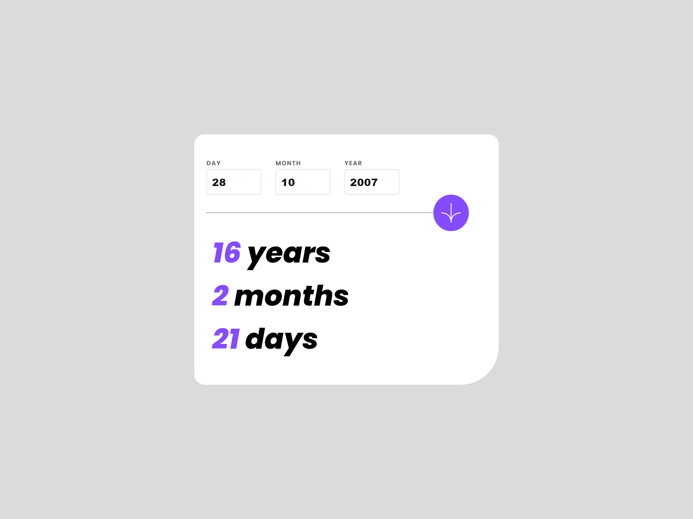

# Frontend Mentor - Age calculator app solution

This is a solution to the [Age calculator app challenge on Frontend Mentor](https://www.frontendmentor.io/challenges/age-calculator-app-dF9DFFpj-Q). Frontend Mentor challenges help you improve your coding skills by building realistic projects.

## Table of contents

- [Frontend Mentor - Age calculator app solution](#frontend-mentor---age-calculator-app-solution)
  - [Table of contents](#table-of-contents)
  - [Overview](#overview)
    - [The challenge](#the-challenge)
    - [Screenshot](#screenshot)
    - [Links](#links)
  - [My process](#my-process)
    - [Built with](#built-with)
    - [What I learned](#what-i-learned)
    - [Continued development](#continued-development)
  - [Author](#author)

## Overview

### The challenge

Users should be able to:

- View an age in years, months, and days after submitting a valid date through the form
- Receive validation errors if:
  - Any field is empty when the form is submitted
  - The day number is not between 1-31
  - The month number is not between 1-12
  - The year is in the future
  - The date is invalid e.g. 31/04/1991 (there are 30 days in April)
- View the optimal layout for the interface depending on their device's screen size
- See hover and focus states for all interactive elements on the page

### Screenshot



### Links

- Solution URL: [GitHub](https://github.com/baenningerlevin/age-calculator)
- Live Site URL: [Netlify](https://levin-baenninger-age-calculator.netlify.app)

## My process

### Built with

- Semantic HTML5 markup
- CSS custom properties
- Flexbox
- Mobile-first workflow
- Vanilla JS

### What I learned

I have learned a ton in this secion and had a lot of fun building this little application. I've learned a lot of new stuff about JavaScript, for example validation or functions:

```js
if (!inputField.value) {
  setErrorState(inputField, 'This field is required');
  isValid = false;
}
```

### Continued development

I still have to learn a lot about JavaScript and the neat little tricks. But I think that now I have mastered the basics of this wonderful language.

## Author

- Website - [Levin Bänninger](https://levinbaenninger.dev)
- Frontend Mentor - [@levinbaenninger](https://www.frontendmentor.io/profile/levinbaenninger)
